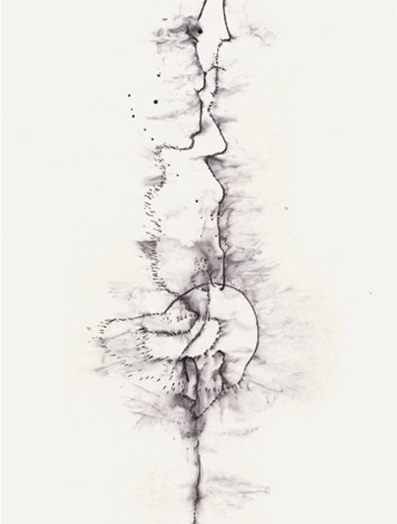

# Reignition

Nick Land’s writings · 2011–

A four-tome online edition of 1,224 texts, edited by Uriel Fiori. 
Read in sequence through the table of contents, move between adjacent texts 
with the page navigation, or search the complete collection.

[Begin with the editor’s introduction →](editors-introduction.md){ .editor-intro-link }

[Download PDF and EPUB editions →](downloads.md){ .editor-intro-link }

<a class="tome-card" href="tome-1/">
  
  
    Tome I
    Urban Future
    Views from the Decopunk Delta
  
</a>
<a class="tome-card" href="tome-2/">
  
  
    Tome II
    The Dark Enlightenment
    Neoreactionaries Head for the Exit
  
</a>
<a class="tome-card" href="tome-3/">
  
  
    Tome III
    Xenosystems
    Involvements with Reality
  
</a>
<a class="tome-card" href="tome-4/">
  
  
    Tome IV
    Abstract Horror
    The Unknown, as The Unknown
  
</a>

